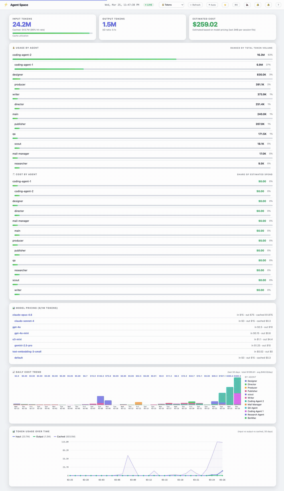
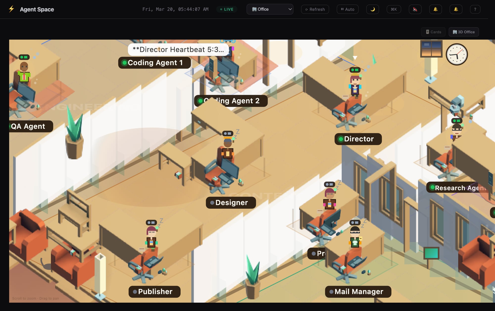
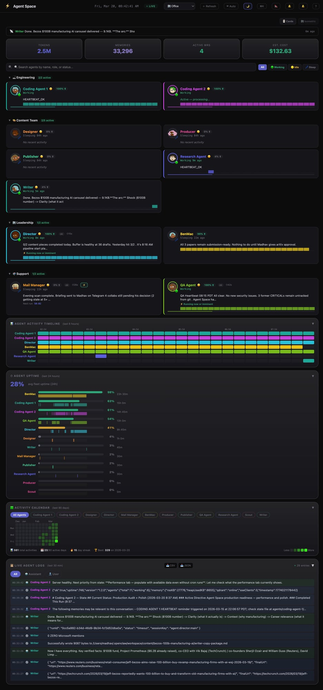
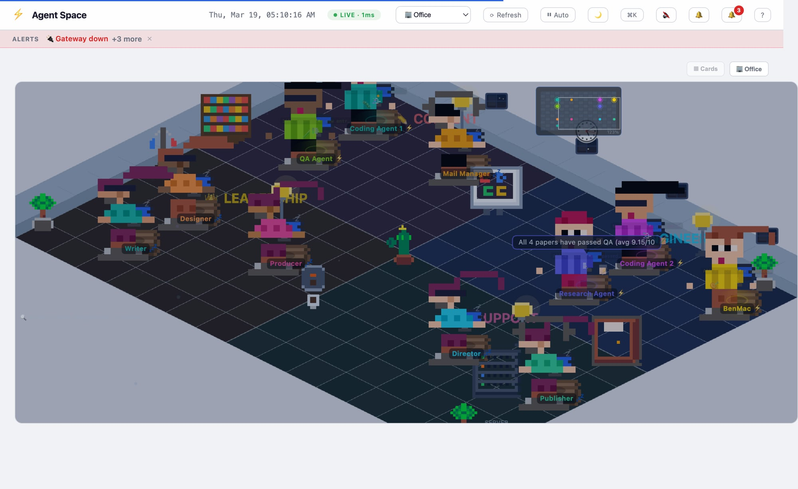
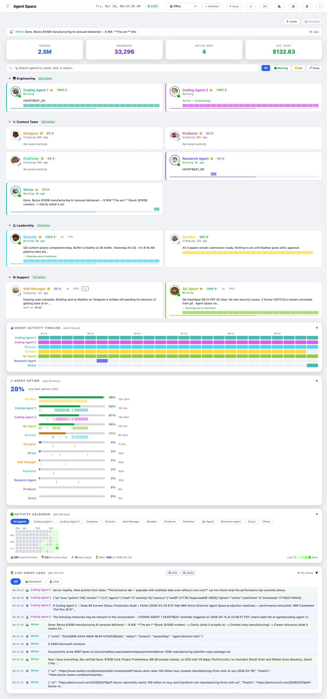

# Agent Space

A real-time dashboard for monitoring your [OpenClaw](https://openclaw.com) AI agent team — presented as an interactive office map.

[](https://github.com/madhavsomani/agent-space/actions/workflows/ci.yml)

[](LICENSE)
[](https://fly.io/launch?source=https://github.com/madhavsomani/agent-space)
[](https://railway.com/template?referralCode=agent-space&template=https://github.com/madhavsomani/agent-space)
[](https://render.com/deploy?repo=https://github.com/madhavsomani/agent-space)

### Demo GIF


### Office Map View (Dark)


### Cards Dashboard View (Dark)


### Office Map View (Light)


### Cards Dashboard View (Light)


## Features

- **Office map** — Leaflet-powered office map with zone overlays, desk slots, and status markers
- **Cards dashboard** — professional card-based view with KPI stats, activity timeline, uptime charts, and live logs
- **View toggle** — switch between Office (map) and Cards view with `V` key or buttons
- **Light/dark theme** — full palette support for both map and card views
- **Live agent status** — markers reflect agent state (working/idle/sleeping) with labels
- **Zone-based layout** — distinct areas for Engineering, Content, Leadership, Support zones
- **Click-to-inspect** — click any agent marker to open a detail panel
- **System health** — CPU, memory, disk, services at a glance with sparklines
- **Work request queue** — Kanban board for task tracking with real-time SSE updates
- **Activity feed** — real-time log of agent actions
- **Token usage** — track input/output/cached tokens with per-agent cost breakdown
- **Performance metrics** — success rates, durations, histograms, per-agent sparklines
- **Communication graph** — force-directed graph with active-only filtering
- **Memory inspector** — Qdrant stats, per-agent file breakdown, growth trends
- **Timeline heatmap** — activity calendar and per-agent uptime charts
- **SSE live updates** — no polling, instant UI updates
- **Dynamic agent discovery** — persistent agents auto-appear at desks, sub-agents shown as visitors
- **Mobile-friendly** — responsive layout optimized down to 375px width

## Quick Start

```bash
# Clone
git clone https://github.com/madhavsomani/agent-space.git
cd agent-space

# Try it instantly with demo data (no OpenClaw needed!)
node server.js --demo
# → http://localhost:18790

# Or run with real data from your OpenClaw agents
cp config.example.json config.json  # optional — agents are auto-discovered
node server.js
```

## Requirements

- **Node.js 22.5+** (uses built-in `node:sqlite`)
- **OpenClaw** installed and running (`~/.openclaw/agents/` directory must exist)
- **Qdrant** (optional) — for memory/vector stats panel

## Configuration

### Environment Variables

| Variable | Default | Description |
|----------|---------|-------------|
| `BIND_HOST` | `127.0.0.1` | Network interface. Use `0.0.0.0` for LAN/remote access. |

### Agent Config

Agent Space auto-discovers agents from `~/.openclaw/agents/` by scanning for directories with `sessions/` or `memory/` subdirectories.

To customize agent display names, colors, roles, or link cron jobs, create `config.json` from the example:

```bash
cp config.example.json config.json
```

### Config fields per agent

| Field | Description |
|-------|-------------|
| `name` | Display name |
| `role` | Role subtitle |
| `color` | Hex color for UI |
| `sessionKey` | OpenClaw session key |
| `cronJobId` | Cron job UUID (for cron-based agents) |
| `persistent` | `true` if agent runs on a cron loop |

## Docker

```bash
docker build -t agent-space .
docker run -p 18790:18790 -v ~/.openclaw:/root/.openclaw:ro agent-space
```

### Docker Compose (with Qdrant)

```bash
cp config.example.json config.json  # customize agents
OPENCLAW_HOME=$HOME/.openclaw docker compose up -d
# → http://localhost:18790
```

Notes:
- Container binds `0.0.0.0:18790` by default.
- Compose mounts `${OPENCLAW_HOME:-$HOME/.openclaw}` read-only into `/root/.openclaw`.
- Local secrets/state files are excluded from image via `.dockerignore`.

### Deploy to Fly.io

```bash
fly launch --copy-config --no-deploy
fly secrets set DASHBOARD_PASSWORD=yourpassword  # optional
fly deploy
```

Or use the deploy button at the top of this README.

## Architecture

- **`server.js`** — Node.js HTTP server with REST API + SSE (zero npm deps)
- **`index.html`** — Single-file frontend (vanilla JS, no build step)
- **`tab-*.js`** — modular tab renderers (queue, tokens, comm graph, system, timeline, etc.)
- **`office-map.js` / `office-view.js`** — Leaflet office map + card/map view orchestration
- **No dependencies** — zero npm packages required

## Production Notes

- **Auth / RBAC**: token-based auth with admin/viewer roles (see `config.json` → `auth`)
- **Rate limiting**: API sliding-window limiter enabled by default (`rateLimit` in config)
- **Log rotation**: built-in rotating app logs under `logs/agent-space.log`
  - env override: `AGENT_SPACE_LOG_MAX_BYTES`
  - env override: `AGENT_SPACE_LOG_KEEP_FILES`
- **Health endpoint**: `/api/health` includes uptime, agent counts, memory metrics, qdrant state
- **Auth status endpoint**: `/api/auth-status`
- **Log status endpoint**: `/api/log-status`

## API Endpoints

| Endpoint | Description |
|----------|-------------|
| `GET /api/agents` | Agent list with status |
| `GET /api/system` | CPU, memory, disk, services |
| `GET /api/health-score` | Composite 0-100 health score |
| `GET /api/activity` | Recent activity feed |
| `GET /api/queue` | Work request queue |
| `GET /api/tokens` | Token usage summary |
| `GET /api/tokens/daily` | Daily token breakdown (14 days) |
| `GET /api/memory` | Qdrant vector memory stats + per-agent breakdown |
| `GET /api/performance` | Cron agent performance metrics |
| `GET /api/comm-graph` | Agent communication graph data |
| `GET /api/events` | SSE stream for live updates |
| `GET /api/auth-status` | Auth mode, token-role summary |
| `GET /api/users` | Multi-user role catalog (token-derived) |
| `GET /api/user/me` | Current auth context |
| `GET /api/webhooks/status` | Slack/Discord webhook config status |
| `POST /api/webhooks/test` | Send test webhook notification |
| `GET /api/log-status` | App log rotation/size status |
| `GET /api/export/agents` | Export agents (JSON/CSV) |
| `GET /api/export/tokens` | Export token data (JSON/CSV) |
| `GET /api/export/activity` | Export activity feed (JSON/CSV) |
| `GET /api/export/logs` | Export live logs (JSON/CSV) |
| `GET /api/export/queue` | Export queue board data (JSON/CSV) |
| `GET /api/agent-detail/:id` | Detailed agent info |
| `POST /api/queue` | Create a new work request |
| `POST /api/wake-agent` | Trigger a cron agent manually |

## Contributing

PRs welcome! Agent Space has zero npm dependencies by design — keep it that way.

## License

MIT
