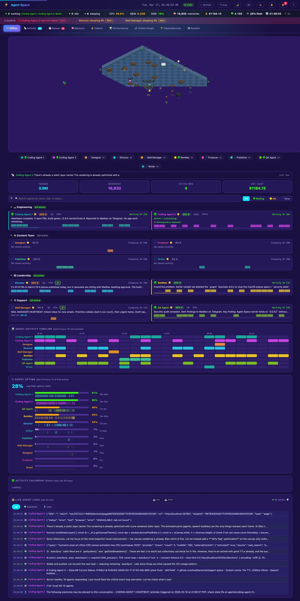

# Agent Space

A real-time dashboard for monitoring your [OpenClaw](https://openclaw.com) AI agent team.




## Features

- **3D virtual office** — Three.js isometric office with zone-based layout, walking animations, and agent desks
- **Live agent status** — agents visually move between zones based on state (working → desk, idle → lounge, review → whiteboard)
- **Fade-in/out animations** — agents appear and disappear smoothly as they come online/offline
- **Zone boundaries & path lines** — visual indicators showing office zones and agent movement paths
- **System health** — CPU, memory, disk, services at a glance
- **Work request queue** — Kanban board for task tracking
- **Activity feed** — real-time log of agent actions
- **Token usage** — track input/output/cached tokens with cost estimates
- **Performance metrics** — success rates, durations, error logs for cron agents
- **Communication graph** — visualize which agents talk to each other
- **Timeline heatmap** — 6-hour activity heatmap per agent
- **SSE live updates** — no polling, instant UI updates
- **Dynamic agent discovery** — persistent agents auto-appear at desks, sub-agents shown as visitors
- **Mobile-friendly** — responsive viewport sizing, no dark voids

## Quick Start

```bash
# Clone
git clone https://github.com/openclaw/agent-space.git
cd agent-space

# Try it instantly with demo data (no OpenClaw needed!)
node server.js --demo
# → http://localhost:18790

# Or run with real data from your OpenClaw agents
cp config.example.json config.json  # optional — agents are auto-discovered
node server.js
```

## Requirements

- **Node.js 22.5+** (uses built-in `node:sqlite`)
- **OpenClaw** installed and running (`~/.openclaw/agents/` directory must exist)
- **Qdrant** (optional) — for memory/vector stats panel

## Configuration

### Environment Variables

| Variable | Default | Description |
|----------|---------|-------------|
| `BIND_HOST` | `127.0.0.1` | Network interface. Use `0.0.0.0` for LAN/remote access. |

### Agent Config

Agent Space auto-discovers agents from `~/.openclaw/agents/` by scanning for directories with `sessions/` or `memory/` subdirectories.

To customize agent display names, colors, roles, or link cron jobs, create `config.json` from the example:

```bash
cp config.example.json config.json
```

### Config fields per agent

| Field | Description |
|-------|-------------|
| `name` | Display name |
| `role` | Role subtitle |
| `color` | Hex color for UI |
| `sessionKey` | OpenClaw session key |
| `cronJobId` | Cron job UUID (for cron-based agents) |
| `persistent` | `true` if agent runs on a cron loop |

## Docker

```bash
docker build -t agent-space .
docker run -p 18790:18790 -v ~/.openclaw:/root/.openclaw:ro agent-space
```

### Docker Compose (with Qdrant)

```bash
cp config.example.json config.json  # customize agents
docker compose up -d
# → http://localhost:18790
```

## Architecture

- **`server.js`** — Node.js HTTP server with REST API + SSE
- **`index.html`** — Single-file frontend (vanilla JS, no build step)
- **`office3d.js`** — Three.js 3D office renderer (zone layout, walking, fade animations)
- **No dependencies** — zero npm packages required (Three.js loaded via CDN)

## API Endpoints

| Endpoint | Description |
|----------|-------------|
| `GET /api/agents` | Agent list with status |
| `GET /api/system` | CPU, memory, disk, services |
| `GET /api/health-score` | Composite 0-100 health score |
| `GET /api/activity` | Recent activity feed |
| `GET /api/queue` | Work request queue |
| `GET /api/tokens` | Token usage summary |
| `GET /api/tokens/daily` | Daily token breakdown (14 days) |
| `GET /api/memory` | Qdrant vector memory stats |
| `GET /api/performance` | Cron agent performance metrics |
| `GET /api/events` | SSE stream for live updates |
| `GET /api/agent-detail/:id` | Detailed agent info |
| `POST /api/queue` | Create a new work request |
| `POST /api/wake-agent` | Trigger a cron agent manually |

## Contributing

PRs welcome! Agent Space has zero npm dependencies by design — keep it that way.

## License

MIT
